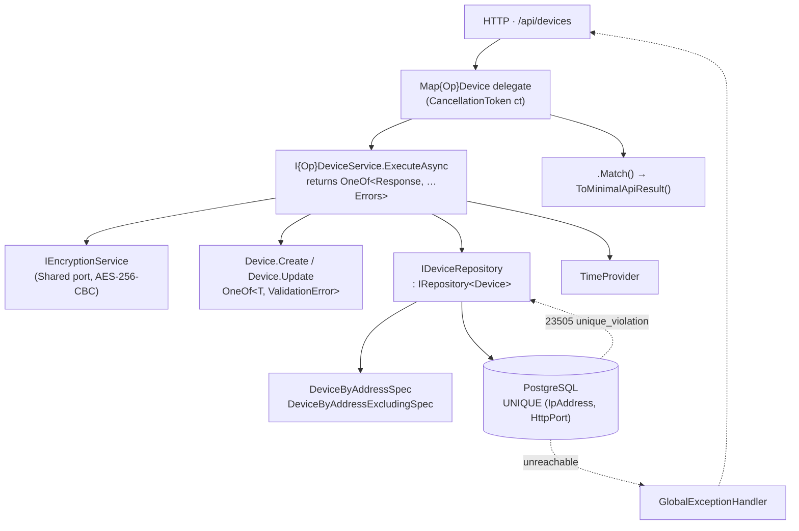

# Device Registry Design

**Spec**: `.specs/features/device-registry/spec.md` (confirmed · 2026-08-12)
**Status**: Approved · 2026-08-12
**Governed by**: AD-001…AD-010, AD-013, AD-014, AD-018, AD-019, AD-020, AD-021
**Layout**: Approach A — single `HikvisionReplicator.Api` project (confirmed 2026-08-12)
**Lessons loaded**: `lessons.py list --status confirmed` → none (store empty)

---

## Architecture Overview

Five vertical slices over one aggregate, on the walking skeleton this feature also
lays down: PostgreSQL with real migrations, RFC 7807 errors, OpenTelemetry, and a
Testcontainers-backed test harness. Layering stays folder-enforced per AD-001; the
one backwards edge in the reference implementation (`Features → Infrastructure` for
`IEncryptionService`) is removed by relocating that interface to `Shared`.

**Write path, register:** validate plaintext password present → encrypt → `Device.Create`
(validates every field, normalizes the address) → `DeviceByAddressSpec` pre-check for a
friendly 409 → `AddAsync`, where a race that slips past the pre-check surfaces as
PostgreSQL `23505` and is translated to the same `ConflictError`. The database is the
authority (A-3); the pre-check only buys a better message.

---

## Code Reuse Analysis

`src/` is deleted in this feature's first commit (AD-013), so nothing is *referenced* —
but the reference implementation is a working template for most of this. Reuse here
means **port the file, apply the listed fix**.

### Port with fixes

| Reference file | Reuse | Change required |
|---|---|---|
| `Domain/Device.cs` | Port structure: private ctor, `Create`/`Update` returning `OneOf`, nested `Errors` constants | Add `FaceCapacity`; take `now` as a parameter in `Update` (not `DateTime.UtcNow`); only advance `UpdatedAt` when a field actually changed (DEV-23) |
| `Domain/IpAddress.cs` | Port whole | **Store the normalized form** — `IPAddress.Parse(value).ToString()`, not the raw input (A-2, DEV-07) |
| `Domain/Port.cs` | Port whole | None (`1…65535` already matches DEV-04) |
| `Domain/Specs/DeviceByAddressSpec.cs` | Port whole | Add a sibling `DeviceByAddressExcludingSpec(ip, port, excludeId)` for DEV-20 |
| `Infrastructure/EncryptionService.cs` | Port the AES-256-CBC `IV:ciphertext` format verbatim (AD-008, A-8) | Interface moves to `Shared/IEncryptionService.cs`; key validation moves to options-with-`ValidateOnStart` so a bad key fails at startup (DEV-15) |
| `Infrastructure/DomainErrorExtensions.cs` | Port whole | None |
| `Infrastructure/DeviceConfiguration.cs` | Port whole — value converters, unique index | Add `FaceCapacity` converter; `HasDatabaseName` on the unique index so the 23505 translation can key off it |
| `Infrastructure/GlobalExceptionHandler.cs` | Port structure | Add `DbException`/`NpgsqlException` → 503 with a generic detail (DEV-14) |
| `Infrastructure/DeviceRepository.cs` | Ardalis `RepositoryBase<Device>` | Implement the new `IDeviceRepository` with unique-violation translation |
| `Shared/{IAggregateRoot,IRepository,Errors}.cs` | Port whole | None |
| `Features/Devices/**` (5 slices × 3 files) | Port the three-file slice shape and `.Match()` wiring | Rename operations to domain language; inject `TimeProvider`; add capacity field |
| `Tests/TestWebApplicationFactory.cs` | Port the factory shape and config-override trick | **Rewrite the database half** — Testcontainers PostgreSQL + `Migrate()` + Respawn, replacing in-memory SQLite (AD-019, DEV-13) |
| `E2ETests/DeviceEndpointsTests.cs` | Port the Playwright `APIRequest` pattern | Retarget at the renamed routes; add capacity |
| `docker-compose.yml` | Keep Tempo + Grafana as-is | Add a `postgres` service (AD-018) |

### Do not port

| Reference item | Reason |
|---|---|
| `Program.cs:72` `db.Database.EnsureCreated()` | Directly violates DEV-12 — bypasses migration history |
| Hangfire + `Hangfire.Storage.SQLite` | No deferred work in this feature; job runner is OD-3, decided in Phase 2 |
| `Domain/{User,Replication,AccessCode,*Status,*Type}.cs`, `Features/Users/**` | Phase 1 item 2 and Phase 2 |
| All four existing migrations | New provider, new schema — one fresh `InitialCreate` |
| `Microsoft.EntityFrameworkCore.Sqlite` | Replaced by `Npgsql.EntityFrameworkCore.PostgreSQL` |

### Package set (versions verified against nuget.org, 2026-08-12)

| Package | Version | Note |
|---|---|---|
| `Npgsql.EntityFrameworkCore.PostgreSQL` | `10.0.3` | Latest **stable** for EF Core 10; 11.x is preview-only |
| `Ardalis.Specification.EntityFrameworkCore` | `9.3.1` | Reference pinned 9.0.0 |
| `OneOf` | `3.0.271` | Unchanged |
| `CSharpFunctionalExtensions` | `3.7.0` | `ValueObject` base |
| `Microsoft.AspNetCore.OpenApi`, `Scalar.AspNetCore` | `10.0.5`, `2.13.22` | Unchanged |
| `OpenTelemetry.*` | as reference | Unchanged |
| `Testcontainers.PostgreSql` | `4.13.0` | Tests only |
| `Respawn` | `7.0.0` | Tests only |

---

## Components

### `Device` (aggregate root)

- **Purpose**: The device catalogue entry, valid by construction.
- **Location**: `Domain/Device.cs`
- **Interfaces**:
  - `static OneOf<Device, ValidationError> Create(string? name, string? ipAddress, int? httpPort, string? username, string encryptedPassword, int? faceCapacity, DateTime now)`
  - `OneOf<Success, ValidationError> Update(string? name, string? ipAddress, int? httpPort, string? username, string? encryptedPassword, int? faceCapacity, DateTime now)` — validates everything before mutating anything (DEV-19), applies only non-null fields (DEV-18), advances `UpdatedAt` only if a value actually differs (DEV-23)
  - Nested `static class Errors` — field names and messages as constants, so tests assert on the constant
- **Dependencies**: `IpAddress`, `Port`, `FaceCapacity`, `Shared.Errors`
- **Reuses**: reference `Device.cs` structure

### `IpAddress`, `Port`, `FaceCapacity` (value objects)

- **Purpose**: Make an invalid address, port, or capacity unrepresentable.
- **Location**: `Domain/`
- **Interfaces**: `static OneOf<T, ValidationError> Create(...)` · `internal static T FromPersistence(...)` · `GetEqualityComponents()`
- **Rules**: `IpAddress` accepts anything `IPAddress.TryParse` accepts and **stores `.ToString()`** (A-1, A-2). `Port` is `1…65535`. `FaceCapacity` is `1…1_000_000` (A-4).
- **Reuses**: `CSharpFunctionalExtensions.ValueObject`

### `IDeviceRepository`

- **Purpose**: Persist a device with the address-uniqueness invariant enforced by the database, translating the constraint violation into a domain error so no slice ever sees a provider exception.
- **Location**: `Shared/IDeviceRepository.cs` (contract) · `Infrastructure/DeviceRepository.cs` (implementation)
- **Interfaces**:
  - `interface IDeviceRepository : IRepository<Device>`
  - `Task<OneOf<Success, ConflictError>> AddIfAddressFreeAsync(Device device, CancellationToken cancellationToken)`
  - `Task<OneOf<Success, ConflictError>> SaveIfAddressFreeAsync(CancellationToken cancellationToken)` — the update path
- **Behaviour**: wraps `SaveChangesAsync`; catches `DbUpdateException` whose inner `PostgresException.SqlState == "23505"` on the device address index and returns `ConflictError`. Any other exception propagates.
- **Dependencies**: `AppDbContext`, Ardalis `RepositoryBase<Device>`
- **Reuses**: reference `DeviceRepository.cs`

### Slices — `Features/Devices/{Register,Get,List,Update,Remove}Device/`

Three files each per AD-001 (`.Interface.cs` / `.cs` / `.Endpoint.cs`), per-slice DTOs per AD-004.

| Slice | Route | Service signature | Requirements |
|---|---|---|---|
| `RegisterDevice` | `POST /api/devices` | `Task<OneOf<DeviceResponse, ValidationError, ConflictError>>` | DEV-01…DEV-07 |
| `GetDevice` | `GET /api/devices/{id}` | `Task<OneOf<DeviceResponse, NotFoundError>>` | DEV-10 |
| `ListDevices` | `GET /api/devices` | `Task<IReadOnlyList<DeviceResponse>>` — infallible, returns the value directly (AD-003) | DEV-08, DEV-09 |
| `UpdateDevice` | `PUT /api/devices/{id}` | `Task<OneOf<DeviceResponse, ValidationError, NotFoundError, ConflictError>>` | DEV-18…DEV-23 |
| `RemoveDevice` | `DELETE /api/devices/{id}` | `Task<OneOf<Success, NotFoundError>>` | DEV-11, DEV-24, DEV-25 |

- **Dependencies**: `IDeviceRepository`, `IEncryptionService`, `TimeProvider`
- **Response shape** (every slice declares its own copy): `id`, `name`, `ipAddress`, `httpPort`, `username`, `faceCapacity`, `createdAt`, `updatedAt`. **No password field of any kind** (DEV-07).

### Walking skeleton — `Program.cs`

- `AddDbContext<AppDbContext>(o => o.UseNpgsql(...))`; **`db.Database.Migrate()`** at startup, never `EnsureCreated()` (DEV-12)
- `AddOptions<EncryptionOptions>().Bind(...).Validate(...).ValidateOnStart()` — a missing or non-32-byte key aborts startup with a named diagnostic (DEV-15)
- `AddProblemDetails()` + `AddExceptionHandler<GlobalExceptionHandler>()` (DEV-14)
- OpenTelemetry registered **only when `OpenTelemetry:OtlpEndpoint` is set** (DEV-16)
- `MapOpenApi()` + `MapScalarApiReference()` **inside `IsDevelopment()`** (DEV-17)
- `TimeProvider.System` registered as a singleton
- `UseRegisterDevice()…` DI chain, then `MapRegisterDevice()…` route chain

### Test harness — `HikvisionReplicator.Tests`

- **`PostgresFixture`** (`ICollectionFixture`): starts one `PostgreSqlContainer` for the collection, applies migrations once, exposes the connection string, builds a `Respawner`.
- **`TestWebApplicationFactory`**: overrides the connection string and `Encryption:Key`, points at the container. `IAsyncLifetime.InitializeAsync` per test calls `Respawner.ResetAsync()` so state is isolated (DEV-13).
- Names follow `docs/test-patterns.md` (AD-019) — behaviour in plain English, no verbs or status codes.
- **DEV-06** needs a dedicated test: N concurrent `POST`s of one address via `Task.WhenAll` → exactly one 201, N−1 × 409, zero 500s.
- **DEV-07** needs a leak sweep: assert the raw `EncryptedPassword` column is neither the plaintext nor absent, and that no response body across the suite contains the plaintext.

---

## Data Models

### `devices` table

| Column | Type | Constraint |
|---|---|---|
| `Id` | `integer` | PK, generated on add |
| `Name` | `varchar(100)` | not null |
| `IpAddress` | `text` | not null · converted from `IpAddress` VO · **normalized form** |
| `HttpPort` | `integer` | not null · converted from `Port` VO |
| `Username` | `varchar(100)` | not null |
| `EncryptedPassword` | `text` | not null · `base64(IV):base64(ciphertext)` |
| `FaceCapacity` | `integer` | not null · converted from `FaceCapacity` VO |
| `CreatedAt` | `timestamptz` | not null |
| `UpdatedAt` | `timestamptz` | not null |

**Indexes**: `IX_devices_IpAddress_HttpPort` UNIQUE — the authority for DEV-05/DEV-06.

**Relationships**: none yet. Phase 2's `Replication` takes a real FK to `Id` (ROADMAP feature 3), and A-5 already decides that deleting a device cancels its pending replications.

---

## Error Handling Strategy

| Scenario | Handling | Caller sees |
|---|---|---|
| Missing/blank/oversized field, unparseable IP, out-of-range port or capacity | Domain factory returns `ValidationError(field, message)` → `Results.ValidationProblem` | `400` naming the field (DEV-02/03/04/19) |
| Address already registered — detected by pre-check | `DeviceByAddressSpec` → `ConflictError` | `409` (DEV-05, DEV-20) |
| Address already registered — lost the race | `23505` caught in `DeviceRepository`, translated to the same `ConflictError` | `409`, no `500` (DEV-06) |
| Unknown id on get/update/delete | `NotFoundError` | `404`, indistinguishable from a deleted id (DEV-10/22/24) |
| Malformed JSON body | ASP.NET `BadHttpRequestException` + `AddProblemDetails()` | `400` problem body, not `500` |
| Database unreachable | `GlobalExceptionHandler` maps `DbException`/`NpgsqlException` → `503` with a **fixed generic detail** — never the exception message, which carries host and database name | `503` problem body, no stack trace, no connection string (DEV-14) |
| Missing/short `Encryption:Key` | Options validation with `ValidateOnStart()` | Process fails to start with a named diagnostic (DEV-15) |
| Anything else | `GlobalExceptionHandler` → `500` problem body | `500`, details logged not returned |

---

## Risks & Concerns

| Concern | Location | Impact | Mitigation |
|---|---|---|---|
| **IP addresses stored unnormalized** — `IpAddress.Create` returns the raw input string | `src/…/Domain/IpAddress.cs:23` (reference) | `192.168.001.001` and `192.168.1.1` are different index keys, so the unique constraint is bypassable by rewriting the same address — the exact hole A-2 names | Normalize to `IPAddress.Parse(value).ToString()` inside `Create`; edge-case test asserts the pair collides |
| **Read-then-write uniqueness race** — pre-check then `AddAsync` with no constraint fallback | `src/…/Features/Devices/CreateDevice/CreateDeviceService.cs:34-43` (reference) | Two concurrent registrations of one address both pass the pre-check; one gets an unhandled `DbUpdateException` → `500` | Unique index is the authority; `IDeviceRepository` translates `23505` → `ConflictError`; DEV-06 concurrency test proves it |
| **`Update` always advances `UpdatedAt`** and reads `DateTime.UtcNow` internally | `src/…/Domain/Device.cs:119` (reference) | Violates DEV-23 and the empty-body edge case; also untestable without wall-clock tricks | `now` becomes a parameter sourced from `TimeProvider`; `UpdatedAt` advances only inside a `changed` guard |
| **`EnsureCreated()` alongside four migrations** | `src/…/Program.cs:72` (reference) | Migration history never records anything, so migrations silently never apply — a fresh production database diverges from the migration chain | `Migrate()` only; DEV-12 asserts a clean database boots and serves |
| **Endpoints are anonymous while storing device credentials** | whole feature | Anyone reaching the port can register devices or enumerate the fleet. Accepted risk per A-6 | Out of scope by roadmap (Phase 4 `api-auth`). **Deployment constraint recorded here: this must not reach a routable network before `api-auth` ships.** |
| **AES-256-CBC has no integrity tag** | `Infrastructure/EncryptionService.cs` | Tampered ciphertext fails at decrypt time rather than being detected; no authentication of the stored blob | Carried forward unchanged per A-8/AD-008. Flagged for the `api-auth` hardening pass — a format migration to AES-GCM will need a versioned ciphertext prefix, easier to add now than later |
| **Password could leak through EF/OTel telemetry** | `Program.cs` OTel setup | DEV-07 says no ciphertext in traces; EF instrumentation can be configured to emit SQL text with parameters | Never call `EnableSensitiveDataLogging()`; leave `SetDbStatementForText` at its default `false`; verified by the DEV-07 leak sweep |
| **`ListDevices` returns a bare array while DEV-26 wants pagination** | `Features/Devices/ListDevices/` | DEV-09 pins the empty case to `[]`, so adding an envelope later is a breaking change for the integrator | Deliberate: P3, and device counts are dozens-to-hundreds. When DEV-26 lands it ships as a paged shape behind query parameters or a `v2` route, not by mutating this response |
| **No test asserts logs are password-free**, only responses | test harness | A logging regression could leak credentials without failing the suite | The DEV-07 sweep captures the test log sink and asserts the plaintext appears in no log line |

---

## Tech Decisions (non-obvious only)

| Decision | Choice | Rationale |
|---|---|---|
| Uniqueness enforcement | DB unique index is the authority; repository translates `23505` → `ConflictError`; pre-check kept only for the friendly message | A pre-check alone is racy (DEV-06); catching the constraint alone gives a worse message on the common path. **Candidate AD-022** — Phase 2's idempotency rules need the same pattern |
| Where the provider exception is caught | Inside `DeviceRepository`, behind `IDeviceRepository` | Keeps `PostgresException` out of the slices; services stay provider-agnostic and see only `OneOf` values (AD-002) |
| Time source | `TimeProvider` injected into services; `now` passed into domain factories and mutators | DEV-23 needs deterministic `UpdatedAt` assertions, and Phase 2's retry backoff and latency SLO need a controllable clock. **Candidate AD-023** |
| Plaintext-password validation lives in the service, not the domain | `RegisterDeviceService` rejects a blank password before encrypting | The aggregate only ever sees ciphertext; teaching it about encryption would drag an infrastructure port into `Domain/`. A narrow, documented exception to AD-005 |
| `IEncryptionService` location | `Shared/`, implementation stays in `Infrastructure/` | Removes the `Features → Infrastructure` backwards edge that Approach A would otherwise inherit |
| Partial update over `PUT` | `PUT /api/devices/{id}` with a partial body (null = unchanged) | DEV-18/DEV-21 specify partial semantics; `PATCH` would be more correct REST but the reference implementation and the integrator's expectations are `PUT`. Recorded rather than silently chosen |
| Test isolation | One container per collection + Respawn reset per test | Container-per-test is far slower; transaction rollback does not work across the HTTP boundary where the app opens its own connections |
| Slice naming | `RegisterDevice` / `ListDevices` / `RemoveDevice` instead of the reference's `CreateDevice` / `GetDevices` / `DeleteDevice` | Matches the spec's user stories and domain language; a rewrite is the only cheap moment to rename |

> **To promote at approval:** AD-022 (constraint-enforced invariants translated in the repository) and AD-023 (`TimeProvider` injected, `now` passed into the domain) are project-level and should be appended to `.specs/STATE.md` `## Decisions` — Phase 2 depends on both.

---

## Requirement Coverage

All 25 P1+P2 requirements map to a component above. DEV-26 (P3 pagination) is
explicitly not designed — see Risks.

| Requirement | Covered by |
|---|---|
| DEV-01 | `RegisterDevice` slice + `Device.Create` |
| DEV-02, DEV-03, DEV-04 | `Device.Create` + `IpAddress`/`Port`/`FaceCapacity` VOs |
| DEV-05 | `DeviceByAddressSpec` pre-check |
| DEV-06 | Unique index + `IDeviceRepository.AddIfAddressFreeAsync` 23505 translation |
| DEV-07 | `EncryptionService` + per-slice response records + OTel/EF logging settings |
| DEV-08, DEV-09 | `ListDevices` slice |
| DEV-10 | `GetDevice` slice |
| DEV-11, DEV-24, DEV-25 | `RemoveDevice` slice (hard delete frees the address) |
| DEV-12 | `Program.cs` `Migrate()` |
| DEV-13 | `PostgresFixture` + Respawn |
| DEV-14 | `GlobalExceptionHandler` `DbException` → 503 |
| DEV-15 | `EncryptionOptions` + `ValidateOnStart()` |
| DEV-16 | Conditional OpenTelemetry registration |
| DEV-17 | `IsDevelopment()` guard on OpenApi + Scalar |
| DEV-18, DEV-19, DEV-23 | `Device.Update` — validate-all-then-mutate, `changed` guard |
| DEV-20 | `DeviceByAddressExcludingSpec` |
| DEV-21 | `UpdateDeviceService` — null password means "leave ciphertext alone" |
| DEV-22 | `UpdateDevice` slice `NotFoundError` |
