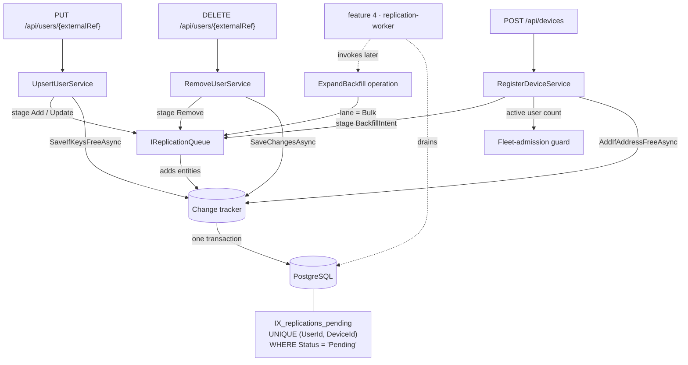

# replication-queue Design

**Spec**: `.specs/features/replication-queue/spec.md`
**Context**: `.specs/features/replication-queue/context.md`
**Status**: Draft

---

## Architecture Overview

A write-path port, two aggregates and one partial unique index. Nothing runs.

The central mechanic: **the queue stages, it never saves.** `IReplicationQueue` adds entities to
the change tracker the calling slice already owns, and the slice's existing single
`SaveChangesAsync` commits user and replications together. REP-07's atomicity is therefore
structural — there is no transaction scope to forget, because there is only ever one save.



The dotted edges are feature 4's. Nothing in this feature calls `ExpandBackfill`; it exists as a
directly-invocable operation, which is how AD-039 says this feature must be testable.

---

## Code Reuse Analysis

### Existing Components to Leverage

| Component | Location | How to Use |
| --- | --- | --- |
| Partial unique index pattern | `Infrastructure/UserConfiguration.cs` (`HasFilter("\"DeletedAt\" IS NULL")`) | Same shape for `IX_replications_pending`, filtered on `Status = 'Pending'` |
| Constraint-violation translation | `Infrastructure/UserRepository.cs:58-73` | Copy the named-index + `23505` switch verbatim in shape; index names stay constants on the configuration class |
| Cascade delete | `Infrastructure/UserConfiguration.cs` (`DeleteBehavior.Cascade` for the face picture) | Same for `Device → Replication` and `Device → BackfillIntent` |
| `IRepository<T>` + Ardalis specs | `Shared/IRepository.cs`, `Domain/Specs/` | All queries go through new specs; no inline LINQ in services (AD-006) |
| `TimeProvider` injection | every service, AD-023 | `now` passed into every factory and transition |
| `ToMinimalApiResult()` | `Infrastructure/DomainErrorExtensions.cs` | The capacity refusal is a `ConflictError`, so it maps with no endpoint change |
| Meter registration | `Program.cs:93-96` (`.WithMetrics(...).AddMeter(...)`) | New meter name added here — L-037 |

### Integration Points

| System | Integration Method |
| --- | --- |
| `UpsertUserService` | Stage fan-out at **three** save sites — create (`:86`), restore (`:147`), update (`:205`) |
| `RemoveUserService` | Stage `Remove` **after** the already-tombstoned early return (`:40-41`) |
| `RegisterDeviceService` | Capacity guard before the address check; stage the backfill intent before `AddIfAddressFreeAsync` (`:47`) |
| `UpdateDeviceService` | Capacity guard on a `FaceCapacity` change (REP-23) |
| `RemoveDeviceService` | **No code change** — the cascade is schema-level (`:23` stays a plain hard delete) |

---

## Components

### `Replication` (aggregate root)

- **Purpose**: One unit of intent — put this user on this device, or take them off it.
- **Location**: `Domain/Replication.cs`
- **Interfaces**:
  - `static Replication Create(int userId, int deviceId, ReplicationOperation operation, ReplicationLane lane, DateTime now)`
  - `OneOf<Success, ValidationError> Begin(DateTime now)` — `Pending → InProgress`
  - `OneOf<Success, ValidationError> Succeed(DateTime now)` — `InProgress → Succeeded`
  - `OneOf<Success, ValidationError> Fail(string error, DateTime now)` — `InProgress → Failed`, attempt +1, error truncated to 1,000
  - `OneOf<Success, ValidationError> Retry(DateTime now)` — `Failed → Pending`, attempt count preserved
  - `OneOf<Success, ValidationError> Supersede(DateTime now)` — `Pending → Superseded` only
- **Dependencies**: none — pure logic, `now` passed in (AD-023)
- **Reuses**: `IAggregateRoot`, the `OneOf<Success, ValidationError>` convention (AD-002, AD-005)

### `BackfillIntent` (aggregate root)

- **Purpose**: Records that a newly registered device is owed the whole active roster.
- **Location**: `Domain/BackfillIntent.cs`
- **Interfaces**:
  - `static BackfillIntent Create(int deviceId, DateTime now)`
  - `OneOf<Success, ValidationError> MarkExpanded(DateTime now)` — terminal; a second call is refused
- **Dependencies**: none
- **Reuses**: same aggregate conventions

### `IReplicationQueue` (port)

- **Purpose**: The only way work enters the queue. **Stages into the caller's change tracker; never saves.**
- **Location**: `Shared/IReplicationQueue.cs`
- **Interfaces**:
  - `Task StageForUserAsync(User user, ReplicationOperation operation, ReplicationLane lane, CancellationToken ct)` — supersedes existing `Pending` rows for each pair, stages one new row per registered device
  - `Task StageBackfillAsync(Device device, DateTime now, CancellationToken ct)` — one intent row
  - `Task<int> ExpandBackfillAsync(int deviceId, DateTime now, CancellationToken ct)` — the REP-17…REP-20 rule; stages `Bulk` rows for active users, skipping pairs that already hold a `Pending` row; marks the intent `Expanded`; returns the count staged
- **Dependencies**: `IReplicationRepository`, `IRepository<Device>`, `IRepository<User>`, `TimeProvider`
- **Reuses**: specifications for every read (AD-006)

### `IReplicationRepository`

- **Purpose**: Translates the pending-index violation into a domain error, exactly as `IUserRepository` does for its two keys (AD-022).
- **Location**: `Shared/IReplicationRepository.cs` / `Infrastructure/ReplicationRepository.cs`
- **Interfaces**:
  - `const string DuplicatePendingWork = "Replication work for this user and device is already queued."`
  - `OneOf<Success, ConflictError> TranslateIfDuplicatePending(DbUpdateException exception)`
- **Dependencies**: `AppDbContext`, `ReplicationConfiguration.PendingIndexName`
- **Reuses**: `UserRepository`'s `23505` + named-index switch, shape for shape

### `ReplicationMetrics`

- **Purpose**: The REP-35…REP-38 instruments.
- **Location**: `Infrastructure/ReplicationMetrics.cs`
- **Interfaces**: `Enqueued(operation, lane)`, `Superseded()`, `CapacityExceeded(deviceId)`, `FanOut(size)`
- **Dependencies**: `IMeterFactory`
- **Reuses**: `SkiaFaceImageNormalizer`'s meter pattern — and its registration must be added to `Program.cs` `AddMeter`, or the instruments record into nothing (L-037, REP-39)

### New specifications (`Domain/Specs/`)

`RegisteredDeviceIdsSpec` · `ActiveUserIdsSpec` · `ActiveUserCountSpec` · `PendingReplicationsForUserSpec` · `PendingReplicationPairsForDeviceSpec` · `PendingBackfillIntentForDeviceSpec`

---

## Data Models

```csharp
public enum ReplicationOperation { Add, Update, Remove }
public enum ReplicationLane { Live, Bulk }
public enum ReplicationStatus { Pending, InProgress, Succeeded, Failed, Superseded }
public enum BackfillStatus { Pending, Expanded }

public class Replication : IAggregateRoot
{
    public int Id { get; }
    public int UserId { get; }                  // FK → users (tombstoned, never deleted: AD-034)
    public int DeviceId { get; }                // FK → devices (hard-deleted: DEV-25 → cascade)
    public ReplicationOperation Operation { get; }
    public ReplicationLane Lane { get; }
    public ReplicationStatus Status { get; }
    public int AttemptCount { get; }
    public string? LastError { get; }           // truncated to MaxLastErrorLength = 1000
    public DateTime CreatedAt { get; }
    public DateTime UpdatedAt { get; }
}

public class BackfillIntent : IAggregateRoot
{
    public int Id { get; }
    public int DeviceId { get; }                // FK → devices, UNIQUE (one intent per device)
    public BackfillStatus Status { get; }
    public DateTime? ExpandedAt { get; }
    public DateTime CreatedAt { get; }
    public DateTime UpdatedAt { get; }
}
```

**Relationships**: `Replication` → `User` (restrict; the user row always survives, AD-034) and
→ `Device` (**cascade**; DEV-25 is a hard delete). `BackfillIntent` → `Device` (cascade, unique).

**Indexes**:

| Index | Shape | Serves |
| --- | --- | --- |
| `IX_replications_pending` | `UNIQUE (UserId, DeviceId) WHERE Status = 'Pending'` | REP-09 — the invariant, enforced by the database, never by a read-then-write check |
| `IX_replications_lane_status` | `(Lane, Status)` | Feature 4's drain query; cheap now, expensive to add once the table is large |
| `IX_backfill_intents_device` | `UNIQUE (DeviceId)` | REP-14 — one intent per device |

Enums are stored **as strings**, not ordinals: feature 8 will put this table in front of operators,
and a status column reading `Superseded` rather than `4` is worth the bytes. It also means
inserting a new enum member cannot silently re-map existing rows.

---

## Error Handling Strategy

| Error scenario | Handling | User impact |
| --- | --- | --- |
| Device registered below the active user count (REP-21) | `ConflictError` naming capacity and count | `409` with both numbers in `detail` |
| `FaceCapacity` lowered below the count (REP-23) | Same `ConflictError` | `409` |
| Active count crosses a device's ceiling (REP-24) | Warning log with device, capacity, count + counter | **None** — user is accepted (`2xx`) |
| Duplicate `Pending` row loses the index race (REP-13) | `23505` on `IX_replications_pending` → `ConflictError`; the slice retries the whole operation **once**, since the retry sees the committed row and supersedes it | Normally invisible; a second loss returns `409`, never `500` |
| Replication staging fails for any other reason | Exception propagates; `SaveChanges` never commits | `500`, and **no user row** — REP-07 |
| Expansion invoked for a deleted device (REP-44) | No intent found → stage nothing, return 0 | None — feature 4 sees a no-op |

---

## Risks & Concerns

| Concern | Location (file:line) | Impact | Mitigation |
| --- | --- | --- | --- |
| **Five call sites, one rule.** Fan-out must be staged at three `UpsertUserService` save points, one in `RemoveUserService`, one in `RegisterDeviceService` — the approach's known cost | `Features/Users/UpsertUser/UpsertUserService.cs:86,147,205` | A missed site is a spectator silently queued nowhere — the failure mode this feature exists to remove | One task per call site, each with its own integration test asserting rows exist after the real HTTP call; the verifier's sensor must mutate each site independently |
| **The already-tombstoned early return** — a second `DELETE` returns success without changing anything | `Features/Users/RemoveUser/RemoveUserService.cs:40-41` | Staging before this guard re-queues removals for an already-removed spectator on every repeat call (REP-42) | Stage strictly after the guard; REP-42 is an explicit edge-case criterion, not a code comment |
| **No-op upserts are only detectable by watching `UpdatedAt`** — `User.Update` reports "nothing changed" by not advancing it, and returns no signal | `Domain/User.cs` `Update(...)`, `Features/.../UpsertUserService.cs:205` | Staging unconditionally on the update path breaks REP-04 and fills the live lane with no-ops | Capture `UpdatedAt` before `Update`, compare after, stage only on a change. Chosen over changing the aggregate's signature, which would touch shipped, verified behaviour |
| **Device delete becomes a 500 without the cascade** — `RemoveDeviceService` hard-deletes, and `Replication` holds an FK to it | `Features/Devices/RemoveDevice/RemoveDeviceService.cs:23` | Any device with queued work could not be deleted; DEV-25 regresses from `204` to a constraint violation | `DeleteBehavior.Cascade` on both FKs, with REP-16/REP-40 asserting a delete succeeds *while* pending rows exist |
| **Every user write now reads the device list** | new, in `IReplicationQueue` | An extra query plus N inserts on the hot path AD-038 measures | One id-only specification (`RegisteredDeviceIdsSpec`), not full aggregates; N = 20 at the fixed envelope. REP-38 records fan-out size so the cost is observable rather than assumed |
| **A bounded retry is new control flow in a shipped slice** | `UpsertUserService` | A retry loop that is wrong could double-write or mask a real fault | Bound is exactly one; the retried operation is an idempotent upsert; a second loss returns `409`. Asserted by a test that forces the conflict rather than races for it — a guard reachable only by winning a coin-flip is not a guard (AD-036) |
| **Test coverage gap: nothing today proves a write enqueues anything**, because there is no queue | whole feature | Every REP-01…REP-07 criterion is new ground with no existing test to lean on | Integration tests drive real HTTP and verify by reading the replications table — permitted by AD-036, which governs what *drives* a test, not what it inspects |
| **Expansion has no HTTP surface at all** | `IReplicationQueue.ExpandBackfillAsync` | Its tests cannot be black box, which AD-036 restricts to two named classes | Extended explicitly by **AD-040** — a third contract class, each test carrying the blind-spot sentence |

---

## Tech Decisions

| Decision | Choice | Rationale |
| --- | --- | --- |
| Where fan-out is triggered | Explicit port staged by the slices | Confirmed with the user. Matches AD-002/003 explicitness; atomicity falls out of the single existing `SaveChanges` |
| How atomicity is obtained | Staging into the caller's change tracker — **no explicit transaction** | There is nothing to forget. A `BeginTransaction` in five places is five chances to miss one |
| How REP-04 is detected | Compare `UpdatedAt` across `User.Update` | Does not alter a shipped, verified aggregate's signature |
| Concurrent duplicate `Pending` | Partial unique index + one bounded retry | The index is the authority (AD-022). Rejected pessimistic `SELECT … FOR UPDATE` on the user row: it puts a lock on the hot path AD-038 measures, to serialise a race that is rare at 35 ops/s |
| Enum storage | Strings | Operator-facing via feature 8; ordinals re-map silently when a member is inserted |
| `Replication → User` delete behaviour | Restrict | Users are tombstoned, never deleted (AD-034), so a cascade would be dead code that hides a real violation if it ever fired |
| Expansion's return value | Count of rows staged | Gives feature 4 something to log and gives REP-20's "second invocation stages nothing" a direct assertion |

> **Project-level:** two entries go to `.specs/STATE.md` — **AD-040** (AD-036 extended to a third
> contract class) and **AD-041** (the stage-never-save contract, which feature 4 inherits).
