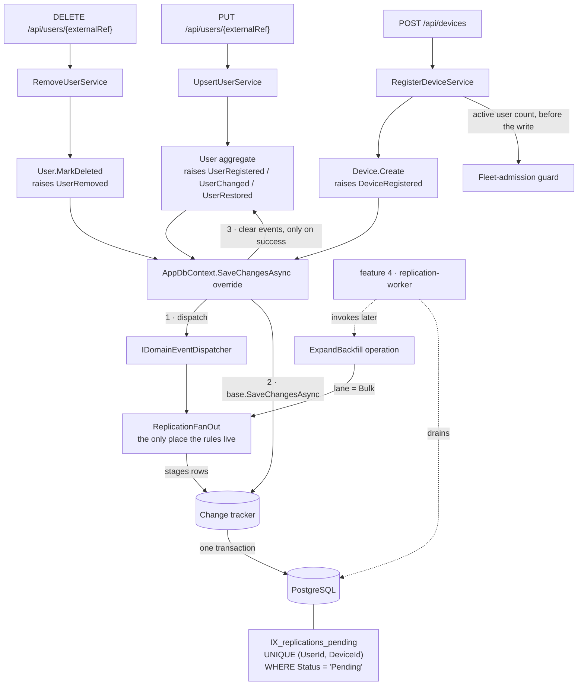

# replication-queue Design

**Spec**: `.specs/features/replication-queue/spec.md`
**Context**: `.specs/features/replication-queue/context.md`
**Status**: Draft

---

## Architecture Overview

Domain events, one fan-out handler, two aggregates and one partial unique index. Nothing runs.

Two mechanics carry the design.

**The aggregate decides whether anything happened.** `User.Update` already computes whether a
field actually differs — that is how USR-26 keeps `UpdatedAt` still on a no-op. It now raises
`UserChanged` from inside that same branch, so REP-04 is not a rule a caller must remember; it is
the absence of an event. `MarkDeleted` is unreachable for an already-tombstoned spectator, so
REP-42 is structural for the same reason, and `Restore` raises a different event than `Update`,
which is REP-06.

**The queue stages, it never saves.** The fan-out handler adds entities to the change tracker the
calling slice already owns, and the slice's existing single `SaveChangesAsync` commits user and
replications together. Dispatch happens **before** `base.SaveChangesAsync`, never after: an
after-commit dispatch would put the rows in a second save and lose REP-07 outright.



The slices do not appear on the fan-out path at all — they save, and the aggregate's own events do
the rest. The dotted edges are feature 4's: nothing here calls `ExpandBackfill`, which exists as a
directly-invocable operation because that is how AD-039 says this feature must be testable.

The guard is the one thing that stays an explicit call in the device slices (REP-21, REP-23). It
**refuses** a write with a `409`, and an event raised by an aggregate that has already been
constructed cannot refuse anything.

---

## Code Reuse Analysis

### Existing Components to Leverage

| Component | Location | How to Use |
| --- | --- | --- |
| Partial unique index pattern | `Infrastructure/UserConfiguration.cs` (`HasFilter("\"DeletedAt\" IS NULL")`) | Same shape for `IX_replications_pending`, filtered on `Status = 'Pending'` |
| Constraint-violation translation | `Infrastructure/UserRepository.cs:58-73` | Copy the named-index + `23505` switch verbatim in shape; index names stay constants on the configuration class |
| Cascade delete | `Infrastructure/UserConfiguration.cs` (`DeleteBehavior.Cascade` for the face picture) | Same for `Device → Replication` and `Device → BackfillIntent` |
| `IRepository<T>` + Ardalis specs | `Shared/IRepository.cs`, `Domain/Specs/` | All queries go through new specs; no inline LINQ in services (AD-006) |
| `TimeProvider` injection | every service, AD-023 | `now` passed into every factory and transition |
| `ToMinimalApiResult()` | `Infrastructure/DomainErrorExtensions.cs` | Both the capacity refusal and the lost duplicate-pending race are `ConflictError`, so each maps to a `409` with no endpoint change |
| The `changed` branch inside `User.Update` | `Domain/User.cs` | Already computes whether a field differs (USR-26) — the event is raised from that same branch, so REP-04 needs no new logic |
| Meter registration | `Program.cs:93-96` (`.WithMetrics(...).AddMeter(...)`) | New meter name added here — L-037 |

### Integration Points

| System | Integration Method |
| --- | --- |
| `UpsertUserService` | **No fan-out code at all.** Its three save sites (`:86`, `:147`, `:205`) are untouched — the events come from the aggregate |
| `RemoveUserService` | **No fan-out code.** The already-tombstoned early return (`:40-41`) never reaches `MarkDeleted`, so no event is raised and REP-42 holds without a guard to remember |
| `RegisterDeviceService` | Capacity guard before the address check (REP-21) — the only explicit call this feature adds to a user-facing slice |
| `UpdateDeviceService` | Capacity guard on a `FaceCapacity` change (REP-23) |
| `RemoveDeviceService` | **No code change** — the cascade is schema-level (`:23` stays a plain hard delete) |
| `AppDbContext` | Gains a `SaveChangesAsync` override: dispatch, then `base`, then clear events on success |
| `User`, `Device` | Raise events from the branches that already decide whether anything changed |

---

## Components

### `Replication` (aggregate root)

- **Purpose**: One unit of intent — put this user on this device, or take them off it.
- **Location**: `Domain/Replication.cs`
- **Interfaces**:
  - `static Replication Create(int userId, int deviceId, ReplicationOperation operation, ReplicationLane lane, DateTime now)`
  - `OneOf<Success, ValidationError> Begin(DateTime now)` — `Pending → InProgress`
  - `OneOf<Success, ValidationError> Succeed(DateTime now)` — `InProgress → Succeeded`
  - `OneOf<Success, ValidationError> Fail(string error, DateTime now)` — `InProgress → Failed`, attempt +1, error truncated to 1,000
  - `OneOf<Success, ValidationError> Retry(DateTime now)` — `Failed → Pending`, attempt count preserved
  - `OneOf<Success, ValidationError> Supersede(DateTime now)` — `Pending → Superseded` only
- **Dependencies**: none — pure logic, `now` passed in (AD-023)
- **Reuses**: `IAggregateRoot`, the `OneOf<Success, ValidationError>` convention (AD-002, AD-005)

### `BackfillIntent` (aggregate root)

- **Purpose**: Records that a newly registered device is owed the whole active roster.
- **Location**: `Domain/BackfillIntent.cs`
- **Interfaces**:
  - `static BackfillIntent Create(int deviceId, DateTime now)`
  - `OneOf<Success, ValidationError> MarkExpanded(DateTime now)` — terminal; a second call is refused
- **Dependencies**: none
- **Reuses**: same aggregate conventions

### Domain events

- **Purpose**: Let the aggregate say what happened, so no caller has to.
- **Location**: `Shared/IDomainEvent.cs`, `Domain/Events/`
- **Events**: `UserRegistered`, `UserChanged`, `UserRestored`, `UserRemoved`, `DeviceRegistered` — each carrying **the aggregate itself** and the `now` that produced it. **Corrected after Phase 1**: the original "only the aggregate id" shape is wrong for the two registration events, which are raised from inside the static factory where the database-generated key is still `0` (`Domain/User.cs:71`, `Domain/Device.cs:77`). Carrying the instance also spares the handler a re-read it would otherwise need
- **Raised from**: `User.Create`, the `changed` branch of `User.Update`, `User.Restore`, `User.MarkDeleted`, `Device.Create`
- **Storage**: `IAggregateRoot` gains `IReadOnlyCollection<IDomainEvent> DomainEvents` and `ClearDomainEvents()`. This extends AD-005's aggregate contract and touches `User` and `Device`, both shipped and verified — recorded as **AD-042**

### `IDomainEventDispatcher`

- **Purpose**: Resolve and run the handlers for every event on every tracked aggregate, once, before the save.
- **Location**: `Shared/IDomainEventDispatcher.cs` / `Infrastructure/DomainEventDispatcher.cs`
- **Interfaces**: `Task DispatchAsync(IReadOnlyCollection<IDomainEvent> events, CancellationToken ct)`
- **Dependencies**: `IServiceProvider` for `IDomainEventHandler<T>` resolution — **no MediatR, no new package**
- **Called from**: `AppDbContext.SaveChangesAsync`, before `base`. Events are cleared **only after `base` succeeds**, so a failed save never silently swallows them

### `ReplicationFanOut` (the single handler)

- **Purpose**: The one place every fan-out rule lives. Handles all five events.
- **Location**: `Infrastructure/ReplicationFanOut.cs`
- **Interfaces**:
  - `IDomainEventHandler<UserRegistered|UserRestored>` → stages `Add`, lane `Live`
  - `IDomainEventHandler<UserChanged>` → stages `Update`, lane `Live`
  - `IDomainEventHandler<UserRemoved>` → stages `Remove`, lane `Live`, superseding any pending `Add`/`Update` (REP-11)
  - `IDomainEventHandler<DeviceRegistered>` → stages one `BackfillIntent`
  - `Task<int> ExpandBackfillAsync(int deviceId, DateTime now, CancellationToken ct)` — the REP-17…REP-20 rule; stages `Bulk` rows for active users, skipping pairs that already hold a `Pending` row; marks the intent `Expanded`; returns the count staged. Not an event handler: feature 4 invokes it directly
- **Dependencies**: `IReplicationRepository`, `IRepository<Device>`, `IRepository<User>`, `TimeProvider`
- **Reuses**: specifications for every read (AD-006). **Stages only — never calls `SaveChanges`** (AD-041)

### `IReplicationRepository`

- **Purpose**: Translates the pending-index violation into a domain error, exactly as `IUserRepository` does for its two keys (AD-022).
- **Location**: `Shared/IReplicationRepository.cs` / `Infrastructure/ReplicationRepository.cs`
- **Interfaces**:
  - `const string DuplicatePendingWork = "Replication work for this user and device is already queued."`
  - `OneOf<Success, ConflictError> TranslateIfDuplicatePending(DbUpdateException exception)`
- **Dependencies**: `AppDbContext`, `ReplicationConfiguration.PendingIndexName`
- **Reuses**: `UserRepository`'s `23505` + named-index switch, shape for shape

### `ReplicationMetrics`

- **Purpose**: The REP-35…REP-38 instruments.
- **Location**: `Infrastructure/ReplicationMetrics.cs`
- **Interfaces**: `Enqueued(operation, lane)`, `Superseded()`, `CapacityExceeded(deviceId)`, `FanOut(size)`
- **Dependencies**: `IMeterFactory`
- **Reuses**: `SkiaFaceImageNormalizer`'s meter pattern — and its registration must be added to `Program.cs` `AddMeter`, or the instruments record into nothing (L-037, REP-39)

### New specifications (`Domain/Specs/`)

`RegisteredDeviceIdsSpec` · `ActiveUserIdsSpec` · `ActiveUserCountSpec` · `PendingReplicationsForUserSpec` · `PendingReplicationPairsForDeviceSpec` · `PendingBackfillIntentForDeviceSpec`

---

## Data Models

```csharp
public enum ReplicationOperation { Add, Update, Remove }
public enum ReplicationLane { Live, Bulk }
public enum ReplicationStatus { Pending, InProgress, Succeeded, Failed, Superseded }
public enum BackfillStatus { Pending, Expanded }

public class Replication : IAggregateRoot
{
    public int Id { get; }
    public int UserId { get; }                  // FK → users (tombstoned, never deleted: AD-034)
    public int DeviceId { get; }                // FK → devices (hard-deleted: DEV-25 → cascade)
    public ReplicationOperation Operation { get; }
    public ReplicationLane Lane { get; }
    public ReplicationStatus Status { get; }
    public int AttemptCount { get; }
    public string? LastError { get; }           // truncated to MaxLastErrorLength = 1000
    public DateTime CreatedAt { get; }
    public DateTime UpdatedAt { get; }
}

public class BackfillIntent : IAggregateRoot
{
    public int Id { get; }
    public int DeviceId { get; }                // FK → devices, UNIQUE (one intent per device)
    public BackfillStatus Status { get; }
    public DateTime? ExpandedAt { get; }
    public DateTime CreatedAt { get; }
    public DateTime UpdatedAt { get; }
}
```

**Relationships**: `Replication` → `User` (restrict; the user row always survives, AD-034) and
→ `Device` (**cascade**; DEV-25 is a hard delete). `BackfillIntent` → `Device` (cascade, unique).

**Navigations exist for the unsaved case, and only there.** `Replication` carries a `User`
navigation and `BackfillIntent` a `Device` navigation, so a row staged for an aggregate that has
not been inserted yet gets its foreign key from EF's fix-up at save time rather than from a `0`.
Both keep their int-based factories for the paths where the aggregate is already persisted and the
id is known — the whole backfill expansion, and live fan-out across already-registered devices.
`Replication` needs no `Device` navigation: a replication is only ever staged against a device that
is already in the catalogue.

**Indexes**:

| Index | Shape | Serves |
| --- | --- | --- |
| `IX_replications_pending` | `UNIQUE (UserId, DeviceId) WHERE Status = 'Pending'` | REP-09 — the invariant, enforced by the database, never by a read-then-write check |
| `IX_replications_lane_status` | `(Lane, Status)` | Feature 4's drain query; cheap now, expensive to add once the table is large |
| `IX_backfill_intents_device` | `UNIQUE (DeviceId)` | REP-14 — one intent per device |

Enums are stored **as strings**, not ordinals: feature 8 will put this table in front of operators,
and a status column reading `Superseded` rather than `4` is worth the bytes. It also means
inserting a new enum member cannot silently re-map existing rows.

---

## Error Handling Strategy

| Error scenario | Handling | User impact |
| --- | --- | --- |
| Device registered below the active user count (REP-21) | `ConflictError` naming capacity and count | `409` with both numbers in `detail` |
| `FaceCapacity` lowered below the count (REP-23) | Same `ConflictError` | `409` |
| Active count crosses a device's ceiling (REP-24) | Warning log with device, capacity, count + counter | **None** — user is accepted (`2xx`) |
| Duplicate `Pending` row loses the index race (REP-13) | `23505` on `IX_replications_pending` → `ConflictError` → `409`. **No in-process retry**: a failed save leaves the already-staged entities tracked, so re-dispatching would double-stage. The integrator re-sends, exactly as it already does for the upsert races `user-registry` ships | `409`, never `500` |
| Replication staging fails for any other reason | Exception propagates; `SaveChanges` never commits | `500`, and **no user row** — REP-07 |
| Expansion invoked for a deleted device (REP-44) | No intent found → stage nothing, return 0 | None — feature 4 sees a no-op |

---

## Risks & Concerns

| Concern | Location (file:line) | Impact | Mitigation |
| --- | --- | --- | --- |
| **A registration event's id is `0` at raise time.** The key is database-generated and the event is raised inside the static factory, before any insert | `Domain/User.cs:71`, `Domain/Device.cs:77` | A handler staging a row from that id writes a foreign key to a nonexistent row — caught by the Phase 1 worker, before any mapping existed to hide it | Events carry the aggregate, not the id, and `Replication`/`BackfillIntent` carry navigations so EF fixes the key up at save. **T6b**, ahead of the mapping tasks |
| **Events are raised from inside shipped, verified aggregates.** `User.Create`, `User.Update`'s changed branch, `User.Restore`, `User.MarkDeleted`, `Device.Create` all gain a line | `Domain/User.cs`, `Domain/Device.cs` | A misplaced raise — outside the `changed` branch, say — breaks REP-04 silently, and these aggregates carry 282 unit tests that will not notice an extra event | One task per aggregate, unit tests asserting *which* events a call raises and that a no-op raises none. The sensor must mutate the raise out of each branch independently |
| **An event with no registered handler is a silent no-op.** Dispatch resolves handlers from DI; a missing registration fans out nothing and throws nothing | `Infrastructure/DomainEventDispatcher.cs`, `Program.cs` | The exact L-037 shape: wired in tests, dead in production | A startup assertion that every `IDomainEvent` in the assembly has at least one handler registered, plus REP-39's meter check in the same test |
| **Events must survive a failed save.** Clearing on dispatch would mean a save that throws loses them | `Infrastructure/AppDbContext.cs` | A retried or subsequent save fans out nothing; the spectator is queued nowhere | Clear **only after `base.SaveChangesAsync` returns**. Asserted by a test that forces a `23505` and then inspects the aggregate's event collection |
| **Dispatch must precede the save, not follow it** | `Infrastructure/AppDbContext.cs` | An after-commit dispatch stages into a *second* save and loses REP-07's atomicity entirely — the whole point of the design | Ordering is one line and one test: force the handler to throw, assert the user row did not commit |
| **Device delete becomes a 500 without the cascade** — `RemoveDeviceService` hard-deletes, and `Replication` holds an FK to it | `Features/Devices/RemoveDevice/RemoveDeviceService.cs:23` | Any device with queued work could not be deleted; DEV-25 regresses from `204` to a constraint violation | `DeleteBehavior.Cascade` on both FKs, with REP-16/REP-40 asserting a delete succeeds *while* pending rows exist |
| **Every user write now reads the device list** | new, in `IReplicationQueue` | An extra query plus N inserts on the hot path AD-038 measures | One id-only specification (`RegisteredDeviceIdsSpec`), not full aggregates; N = 20 at the fixed envelope. REP-38 records fan-out size so the cost is observable rather than assumed |
| **`AppDbContext` stops being a 20-line class** and now runs application logic on every save, for every aggregate, forever | `Infrastructure/AppDbContext.cs` | Every future save pays dispatch cost, and a slow handler slows every write path in the system | The dispatcher short-circuits when no tracked aggregate has events — which is every device read, every list, every get. Measured by REP-38's fan-out histogram |
| **Test coverage gap: nothing today proves a write enqueues anything**, because there is no queue | whole feature | Every REP-01…REP-07 criterion is new ground with no existing test to lean on | Integration tests drive real HTTP and verify by reading the replications table — permitted by AD-036, which governs what *drives* a test, not what it inspects |
| **Expansion has no HTTP surface at all** | `IReplicationQueue.ExpandBackfillAsync` | Its tests cannot be black box, which AD-036 restricts to two named classes | Extended explicitly by **AD-040** — a third contract class, each test carrying the blind-spot sentence |

---

## Tech Decisions

| Decision | Choice | Rationale |
| --- | --- | --- |
| Where fan-out is triggered | **Domain events raised by the aggregate**, dispatched once | Revised from an explicit port called by five sites. Three of this table's original risks — five call sites, the tombstone early return, the `UpdatedAt` comparison — were one root cause: the trigger sat outside the aggregate that already knew the answer |
| Where dispatch hooks in | Override `AppDbContext.SaveChangesAsync`, dispatch **before** `base` | The handler must query the device list. Doing that before the save pipeline opens is unambiguously safe; doing it from inside a `SavingChangesAsync` interceptor depends on reentrancy behaviour I could not verify, and I will not build on an unverified assumption |
| Event plumbing | Hand-rolled `IDomainEventHandler<T>` from DI | MediatR would be a dependency and a pipeline for five events and one handler |
| How atomicity is obtained | Staging into the change tracker — **no explicit transaction** | There is nothing to forget, and dispatch-before-save means the rows are simply part of the save that was already happening |
| How REP-04 is detected | The `changed` branch of `User.Update` raises the event | Not a rule a caller must remember — the absence of a change is the absence of an event |
| Concurrent duplicate `Pending` | Partial unique index → `409`, **no retry** | The index is the authority (AD-022). A retry would re-dispatch over a poisoned change tracker; `user-registry`'s upsert racers already resolve this way. Pessimistic `SELECT … FOR UPDATE` was rejected separately: a lock on the hot path AD-038 measures, to serialise a race that is rare at 35 ops/s |
| Per-user dispatch watermark | **Rejected** | Proposed as a cheap self-heal index for feature 4. Under transactional fan-out it would always equal `UpdatedAt` by construction — a column that can never be behind, and a query that always returns empty. It was load-bearing only in the after-commit design |
| After-commit dispatch + periodic sweeper | **Rejected** | Considered seriously: it decouples and shortens the user write. But decoupling comes from events regardless of *when* they fire; the 20 narrow rows are ~1% of a transaction that already carries a 40–200 KB picture; and the sweeper that makes it safe is a job runner, which AD-039 places in feature 4. The safety net could not be built in this feature |
| Enum storage | Strings | Operator-facing via feature 8; ordinals re-map silently when a member is inserted |
| `Replication → User` delete behaviour | Restrict | Users are tombstoned, never deleted (AD-034), so a cascade would be dead code that hides a real violation if it ever fired |
| Expansion's return value | Count of rows staged | Gives feature 4 something to log and gives REP-20's "second invocation stages nothing" a direct assertion |

> **Project-level:** three entries in `.specs/STATE.md` — **AD-040** (AD-036 extended to a third
> contract class), **AD-041** (the stage-never-save contract, which feature 4 inherits), and
> **AD-042** (the write path fans out through domain events; amends AD-041's trigger clause and
> AD-005's aggregate contract).
