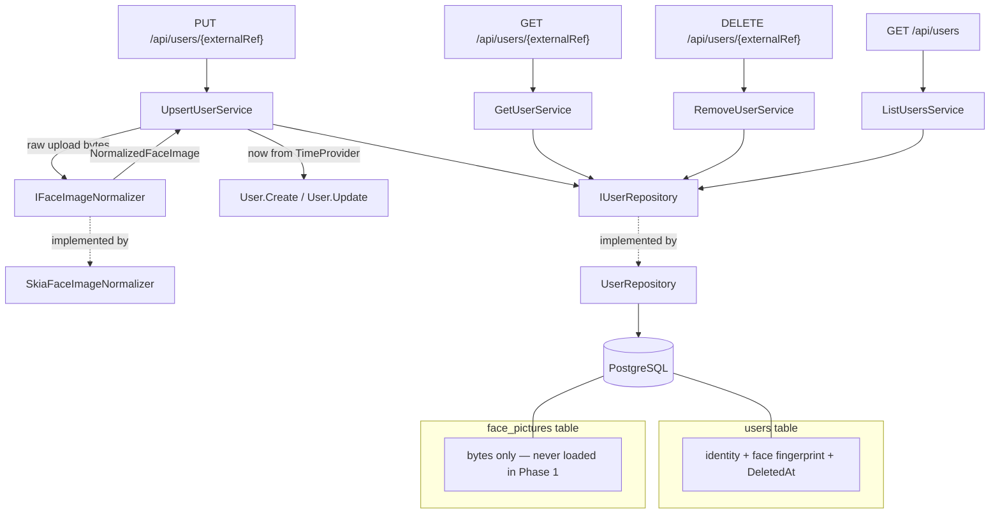

# User Registry Design

**Spec**: [`spec.md`](spec.md) (confirmed 2026-08-24)
**Status**: **Approved** · 2026-08-25
**Conforms to**: AD-001…AD-009, AD-014…AD-016, AD-022, AD-023, AD-024, AD-026, AD-027.
**Supersedes**: nothing. Proposes three new decisions — see § Tech Decisions.

---

## Architecture Overview

One aggregate, one repository, one transaction. The face image is normalized at the API
boundary by a port/adapter pair before the aggregate ever sees it, exactly as a device password
is encrypted before `Device.Create` (AD-008). The aggregate therefore never handles an upload,
only an already-canonical image plus its fingerprint.



**The load-bearing property:** the fingerprint (hash, byte size, dimensions) lives on the `users`
row while the bytes live in `face_pictures`, and the navigation is **not auto-included**. Every
read path in this feature answers entirely from `users`. In Phase 1 the bytes are effectively
**write-only** — nothing in this feature ever reads them back. `replication-worker` opts in later
with an explicit specification.

---

## Code Reuse Analysis

### Existing components to leverage

| Component | Location | How to use |
| --------- | -------- | ---------- |
| Port/adapter for a boundary transform | `Shared/IEncryptionService.cs` + `Infrastructure/EncryptionService.cs` | **Direct template** for `IFaceImageNormalizer` + `SkiaFaceImageNormalizer`. Same shape: injected into the slice service, aggregate sees only the transformed value. |
| Startup-validated options | `Infrastructure/EncryptionOptions.cs` + `EncryptionOptionsValidator` | **Direct template** for `FaceImageOptions`. A bad bound aborts startup rather than failing on first upload. |
| Constraint→`ConflictError` translation | `Infrastructure/DeviceRepository.cs:44-51` | Same `DbUpdateException` → `PostgresException{SqlState, ConstraintName}` shape, extended to **two** named indexes. |
| Named-index configuration | `Infrastructure/DeviceConfiguration.cs:11-14` | Same `public const string …IndexName` convention so the repository can key off it. |
| Value-object mapping | `Domain/IpAddress.cs`, `Port.cs`, `FaceCapacity.cs` + their `ValueConverter`s | Same `Create` / `internal FromPersistence` pair for `ExternalRef` and `AccessCode`. |
| Result pattern & HTTP translation | `Shared/Errors.cs`, `Infrastructure/DomainErrorExtensions.cs` | Unchanged. `ValidationError`/`NotFoundError`/`ConflictError` cover every error in this feature — **no new error type is needed**. |
| Validate-all-then-apply update | `Domain/Device.cs:81-176` | Same two-phase mutator satisfies USR-27 (rejected update leaves the aggregate untouched) and USR-26 (`UpdatedAt` advances only on real change). |
| Global exception handler | `Infrastructure/GlobalExceptionHandler.cs` | Already turns database failure into a 503 problem body — USR-39 needs no new code, only a test. |

### Integration points

| System | Integration method |
| ------ | ------------------ |
| `AppDbContext` | Two `IEntityTypeConfiguration<T>` classes, auto-discovered by the existing `ApplyConfigurationsFromAssembly` (AD-009). Add `DbSet<User>`. |
| `Program.cs` | Four `UseXxx()` + four `MapXxx()` calls, one `AddScoped<IUserRepository, UserRepository>`, one `AddSingleton<IFaceImageNormalizer, SkiaFaceImageNormalizer>`, one options block. |
| Migrations | One new migration adding both tables and both indexes; applied at startup by the existing `db.Database.Migrate()` (USR-38). |
| OpenTelemetry | Existing `AddAspNetCoreInstrumentation`. Normalization adds its **own `ActivitySource`** for USR-40's child span. |

---

## Components

### `User` (aggregate root)

- **Purpose**: The spectator. Owns every identity invariant and the tombstone transition.
- **Location**: `Domain/User.cs`
- **Interfaces**:
  - `static OneOf<User, ValidationError> Create(string? externalRef, string? name, string? accessCode, FaceFingerprint fingerprint, byte[] pictureContent, DateTime now)`
  - `OneOf<Success, ValidationError> Update(string? name, string? accessCode, FaceFingerprint? fingerprint, byte[]? pictureContent, DateTime now)` — a `null` fingerprint/content pair means "keep the stored image" (USR-24)
    > **`name` and `accessCode` are required on update, not optional.** They are declared nullable
    > only so the domain can reject a null, exactly as in `Create`. `PUT` is a full-representation
    > upsert (A-2) and **the picture is the sole exception** (A-4), so `UpsertUserService` must send
    > the complete representation on every update. This deliberately differs from `Device.Update`,
    > where `null` means "leave unchanged" — devices are patched, users are replaced.
  - `OneOf<Success, ValidationError> Restore(string? name, string? accessCode, FaceFingerprint fingerprint, byte[] pictureContent, DateTime now)` — A-7 resurrection; re-imposes every create rule
  - `void MarkDeleted(DateTime now)` — sets `DeletedAt` **and** destroys the picture (USR-29, USR-30)
- **Dependencies**: none — `now` is passed in (AD-023).
- **Reuses**: `Device`'s validate-all-then-apply mutator shape.

### `FacePicture` (entity within the `User` aggregate)

- **Purpose**: Holds the canonical JPEG bytes and nothing else, so they are addressable without being loaded.
- **Location**: `Domain/FacePicture.cs`
- **Interfaces**: `internal static FacePicture ForUser(byte[] content)`; `internal void Replace(byte[] content)`
- **Dependencies**: none. **Not** an `IAggregateRoot` — it has no repository and is reachable only through `User`.

### `ExternalRef`, `AccessCode`, `FaceFingerprint` (value objects)

- **Location**: `Domain/ExternalRef.cs`, `Domain/AccessCode.cs`, `Domain/FaceFingerprint.cs`
- **Interfaces**: each `static OneOf<T, ValidationError> Create(...)` + `internal static T FromPersistence(...)` (AD-005, AD-009)
- **Rules**:
  - `ExternalRef` — non-blank, ≤ 255 chars, **case-sensitive** equality (A-15)
  - `AccessCode` — required, ASCII `0`–`9` only, 4–20 chars (A-10). *ASCII specifically: `char.IsDigit` accepts Arabic-Indic digits, which no device keypad can produce.*
  - `FaceFingerprint` — `(string ContentHash, int ByteSize, int Width, int Height)`; constructed only by the normalizer's output, never from user input

### `IFaceImageNormalizer` (port) / `SkiaFaceImageNormalizer` (adapter)

- **Purpose**: Turn any reasonable upload into an image the device will enrol, or explain why it cannot.
- **Location**: `Shared/IFaceImageNormalizer.cs`, `Infrastructure/SkiaFaceImageNormalizer.cs`
- **Interfaces**: `OneOf<NormalizedFaceImage, ValidationError> Normalize(byte[] upload)`
  - *Synchronous and cancellation-free by design: it is CPU-bound with no I/O, so AD-007's token has nothing to cancel.*
- **Dependencies**: `SkiaSharp`, `SkiaSharp.NativeAssets.Linux`, `IOptions<FaceImageOptions>`
- **Reuses**: `IEncryptionService`'s port/adapter shape; `EncryptionOptions`' startup validation.

**Algorithm** (each step maps to a criterion):

1. `upload.Length > MaxUploadBytes` → reject without decoding (**USR-19**).
2. `SKCodec.Create(stream)`; `null` → not a decodable image (**USR-21**).
3. `codec.Info.Width * Height > MaxDecodePixels` → reject **before allocating** (**USR-20**).
4. Read `codec.EncodedOrigin`; compute *oriented* dimensions. **A 90°/270° origin swaps width and height, so the floor check must run on oriented dimensions, not encoded ones** — otherwise a portrait photo is judged as landscape.
5. Oriented dimensions below the floor → reject, **never upscale** (**USR-17**).
6. Decode into `SKImageInfo` with `SKColorSpace.CreateSrgb()`, then apply the `EncodedOrigin` rotation/flip **manually** — SkiaSharp has no auto-orient (**USR-13**).
7. Above the ceiling → downscale to fit, aspect preserved, no crop (**USR-16**, **USR-18**).
8. **Encode ladder**: walk a fixed descending quality ladder; if still over `MaxByteSize`, scale the longer edge by a fixed factor and walk the ladder again, never crossing the floor. If under `MinByteSize`, walk *up* the ladder. Exhausted → reject (**USR-15**).
9. SHA-256 the derivative → `ContentHash` (**USR-22**).

> **Determinism is a design invariant, not an implementation detail.** USR-26 requires that
> re-sending an identical upload leaves `UpdatedAt` untouched, which holds only if identical input
> bytes produce identical output bytes and therefore an identical hash. That is why step 8 is a
> **fixed ladder rather than a bisection search** — a search would converge to different quality
> values under different starting conditions. This needs its own unit test.

> **Re-encoding strips metadata for free.** SkiaSharp's JPEG encoder writes no EXIF, so USR-14
> (no GPS) falls out of step 6. It is still asserted explicitly — a property that arrives by
> accident can leave the same way.

> **A sub-40 KB rejection is a weak quality signal.** A photograph that cannot reach 40 KB at
> maximum quality and permitted dimensions is nearly uniform — a blank wall or a lens cap, not a
> face. Rejecting it is correct on the device's terms and useful on ours.

### `FaceImageOptions`

- **Purpose**: Every bound from A-13 as configuration, not constants.
- **Location**: `Infrastructure/FaceImageOptions.cs` (+ validator, `ValidateOnStart`)
- **Fields**: `MaxUploadBytes` (8 MB), `MaxDecodePixels` (40 MP), `MinByteSize` (40 KB), `MaxByteSize` (200 KB), `MinShortEdge` (480), `MinLongEdge` (640), `MaxShortEdge` (2159), `MaxLongEdge` (3839), `QualityLadder`, `DownscaleFactor`
- **Why**: A-13 carries a **Phase 3 verification obligation**. Holding the envelope in options makes
  `isapi-device-client`'s correction a configuration change, not a code change.

### `IUserRepository` / `UserRepository`

- **Location**: `Shared/IUserRepository.cs`, `Infrastructure/UserRepository.cs`
- **Interfaces**:
  - `Task<OneOf<Success, ConflictError>> AddIfKeysFreeAsync(User user, CancellationToken cancellationToken)`
  - `Task<OneOf<Success, ConflictError>> SaveIfKeysFreeAsync(CancellationToken cancellationToken)`
  - `const string ExternalRefAlreadyRegistered`, `const string AccessCodeAlreadyInUse`
- **Behaviour**: catches `DbUpdateException` and maps **by constraint name** to the matching message —
  two indexes, two distinct messages, so a caller can tell which key collided. Every other failure
  propagates (AD-022).
- **Reuses**: `DeviceRepository` verbatim in shape.

### Feature slices

`Features/Users/{Operation}/`, three files each (AD-001), per-slice DTOs (AD-004):

| Slice | Route | Service signature |
| ----- | ----- | ----------------- |
| `UpsertUser` | `PUT /api/users/{externalRef}` | `Task<OneOf<UserCreated, UserUpdated, ValidationError, ConflictError>>` |
| `GetUser` | `GET /api/users/{externalRef}` | `Task<OneOf<UserResponse, NotFoundError>>` |
| `RemoveUser` | `DELETE /api/users/{externalRef}` | `Task<OneOf<Success, NotFoundError>>` |
| `ListUsers` (P2) | `GET /api/users` | `Task<PagedUsersResponse>` — infallible, returns the value directly |

`UserCreated` and `UserUpdated` both wrap the same `UserResponse`, so the endpoint's `.Match()`
maps arms directly to `Results.Created` / `Results.Ok` with no branching in the transport layer.

**`UpsertUserService` flow** — the one place all the rules meet:

```text
PUT /api/users/{externalRef}
  → load by ExternalRef INCLUDING tombstoned rows        [A-7 must find the tombstone]
  ├─ absent, or tombstoned  → face picture is MANDATORY  [USR-05, USR-34]
  ├─ present and active     → face picture OPTIONAL      [USR-24 omitted = unchanged]
  ├─ picture supplied → IFaceImageNormalizer.Normalize() → ValidationError short-circuits
  ├─ now = timeProvider.GetUtcNow().UtcDateTime          [AD-023]
  ├─ Create / Restore / Update                            → OneOf<_, ValidationError>
  ├─ pre-check access code held by another ACTIVE user    → friendly ConflictError
  └─ AddIfKeysFreeAsync / SaveIfKeysFreeAsync             → 23505 on either named index
  → Match(created → 201 + Location, updated → 200, validation → 400, conflict → 409)
```

---

## Data Models

```csharp
// users
public class User : IAggregateRoot
{
    public int Id { get; private set; }
    public ExternalRef ExternalRef { get; private set; }      // unique, ALL rows
    public string Name { get; private set; }
    public AccessCode AccessCode { get; private set; }        // unique, ACTIVE rows only
    public FaceFingerprint Face { get; private set; }         // hash + size + dimensions
    public DateTime? DeletedAt { get; private set; }          // null ⇒ active
    public DateTime CreatedAt { get; private set; }
    public DateTime UpdatedAt { get; private set; }
    public FacePicture? Picture { get; private set; }         // NOT auto-included
}

// face_pictures — 1:1 with users, cascade delete
public class FacePicture
{
    public int Id { get; private set; }
    public int UserId { get; private set; }
    public byte[] Content { get; private set; }               // canonical JPEG, 40–200 KB
}

// Shared/ — the normalizer's output, not a domain type
public record NormalizedFaceImage(byte[] Content, string ContentHash, int Width, int Height);
```

**Relationships**: `User` 1 ⟶ 0..1 `FacePicture`, cascade delete. Zero-or-one rather than
exactly-one because `MarkDeleted` destroys the picture while the row survives (A-5).

### Indexes — deliberately asymmetric

| Index | Columns | Filter | Why |
| ----- | ------- | ------ | --- |
| `IX_users_ExternalRef` | `ExternalRef` | **none** | Resurrection (A-7) must find a tombstoned row by key, so the key must stay reserved after deletion. |
| `IX_users_AccessCode` | `AccessCode` | **`WHERE "DeletedAt" IS NULL`** | USR-06 scopes uniqueness to *active* users, so a deleted spectator's PIN returns to the pool. |

A partial unique index is native PostgreSQL, configured with `.HasFilter(...)`. **This asymmetry is
the single most misreadable thing in the schema** — both indexes need a test that proves the filter
behaves as intended, in particular that a PIN is reusable after its holder is deleted.

---

## Error Handling Strategy

| Error scenario | Handling | Caller sees |
| -------------- | -------- | ----------- |
| Blank / oversized `externalRef`, `name`, `accessCode` | `ValidationError` from the value object or aggregate | 400 problem naming the field |
| Face picture missing on create **or resurrection** | `ValidationError` raised in `UpsertUserService`, not the aggregate | 400 naming `facePicture` |
| Upload too large / too many pixels / undecodable | `ValidationError` from the normalizer, **before** any decode allocation | 400 naming `facePicture` |
| Below the resolution floor | `ValidationError` stating the minimum | 400 naming `facePicture` |
| Cannot land in the 40–200 KB band | `ValidationError` after the ladder is exhausted | 400 naming `facePicture` |
| `ExternalRef` race on create | 23505 on `IX_users_ExternalRef` → `ConflictError` in the repository | 409 |
| `AccessCode` taken by an active user | Pre-check for a friendly message; partial index is the authority | 409 |
| `GET`/`DELETE` on unknown or tombstoned ref | `NotFoundError` | 404 |
| `DELETE` on an already-tombstoned user | `Success` — idempotent (A-16) | 204 |
| Database unavailable | Existing `GlobalExceptionHandler` | 503 problem, no connection details |

---

## Risks & Concerns

| Concern | Location | Impact | Mitigation |
| ------- | -------- | ------ | ---------- |
| **Unauthenticated image decoding is a DoS surface.** A-11 accepts no auth until Phase 4, but this endpoint now spends real CPU and memory on attacker-supplied bytes. | new `Features/Users/UpsertUser/` | A handful of concurrent 8 MB uploads can saturate CPU and stall the latency path AD-014 makes primary. | USR-19/USR-20 bound **per-request** cost, and an explicit `RequestSizeLimit` on the route stops the body being buffered before we can reject it. **Nothing bounds request *rate*** — that is `api-auth`'s job, and the deployment constraint (never on a routable network before it ships) is the only real control. Recorded, not solved. |
| **Constraint translation keys off index *names*.** Now two names instead of one. | `Infrastructure/DeviceRepository.cs:44-51`, mirrored in the new `UserRepository` | Renaming an index silently degrades a 409 into a 500 — a pre-existing hazard this feature doubles. | One integration test per constraint that provokes the real race, asserting 409 and not 500. |
| **"Not auto-included" is a convention, not a constraint.** | `Infrastructure/UserConfiguration.cs`, `Domain/Specs/` | A future spec adding `.Include(u => u.Picture)` to a list query silently reintroduces 200 KB per row — the exact bloat OD-4 exists to prevent. | A test asserting that listing and getting users issues no read against `face_pictures`. Also stated as a comment at the navigation. |
| **`ExternalRef` in a route segment may not survive A-15.** A-15 permits *any* non-blank string, but `{externalRef}` matches a single segment, so a ref containing `/` cannot round-trip, and `%2F` handling differs across hosts. | `Features/Users/*/…Endpoint.cs` | An integrator whose keys contain `/` gets 404s that look like missing data. | An explicit edge-case test round-tripping reserved characters through `PUT`/`GET`/`DELETE`. **If it cannot be made to work, A-15 is amended to exclude `/` — a spec change, not a silent code workaround.** |
| **SkiaSharp needs native assets in the container and in CI.** | new `HikvisionReplicator.Api.csproj`, `.github/workflows/ci.yml` | Passes locally, fails at runtime in CI or Docker with a native-load error. | `SkiaSharp.NativeAssets.Linux` referenced from the start; the normalizer's unit tests run in CI, so a missing native asset fails the build rather than production. |
| **Trace assertions can pass on scheduling luck.** USR-40 asserts a normalization span. | `IntegrationTests/TracingTests.cs` pattern | The OTel listener is process-wide, so an unfiltered assertion passes or fails on which host happened to be alive. | Follow the recorded pattern in `docs/test-patterns.md`: send a `traceparent` and filter spans by that trace id. |
| **Golden hashes fail on a SkiaSharp upgrade.** | `Tests/Infrastructure/` fixtures | A routine dependency bump looks like a test regression and invites someone to delete the assertion. | The intended response — review and re-record, never loosen — is stated in the test file, not only in this design. |
| **A quiet incremental build is not evidence** (lesson **L-007**, confirmed ×2). | whole build | Adding SkiaSharp could introduce warnings that an up-to-date build re-reports as zero. | Any claim that this feature introduced no warnings must come from `--no-incremental`. |
| **Pre-existing NU1903/CS0618 warnings.** | solution-wide | A newcomer may try `-warnaserror` and fail the build on unrelated advisories. | Already documented in `Directory.Build.props`; unchanged by this feature. |

---

## Tech Decisions

| Decision | Choice | Rationale |
| -------- | ------ | --------- |
| Face bytes vs. fingerprint | Bytes in `face_pictures`; hash/size/dimensions denormalized onto `users` | Every Phase 1 read answers from `users` alone; Phase 2 gets change detection without reading bytes. **Resolves OD-4.** |
| Imaging library | SkiaSharp (MIT) + `SkiaSharp.NativeAssets.Linux` | ImageSharp v4 fails the build without a committed `sixlabors.lic`, whose free sample expires 2026-09-04. Magick.NET is a far larger native footprint than decode/rotate/resize/encode needs. |
| Where normalization runs | Port + adapter, at the service boundary | Mirrors `IEncryptionService` (AD-008): the aggregate never sees an untransformed value. |
| Encode search strategy | Fixed descending ladder, never bisection | Determinism is required by USR-26 — identical upload must yield an identical hash. |
| Envelope as options, not constants | `FaceImageOptions`, validated at startup | A-13's Phase 3 obligation becomes a config change. |
| Deletion marker | `DeletedAt DateTime?` | Carries *when*, and is the natural partial-index filter. The reference implementation's `UserStatus{PendingAdd,PendingRemove}` conflated lifecycle with replication state, which is Phase 2's to own. |
| Access-code uniqueness scope | Partial unique index filtered on `DeletedAt IS NULL` | The only way USR-06 ("another *active* user") and USR-30 (tombstone keeps identity fields) can both hold. |
| Normalizer is synchronous | No `CancellationToken` | CPU-bound, no I/O — AD-007's token would have nothing to cancel. |

### Proposed project-level decisions

To append to `.specs/STATE.md § Decisions` **after this design is approved** — each sets a
convention future features must follow:

- **AD-032** — Binary payloads are stored in a dedicated table with a fingerprint (hash, size,
  dimensions) denormalized onto the owning aggregate; the navigation is never auto-included.
  *Resolves ROADMAP OD-4.*
- **AD-033** — External-format constraints are normalized at the API boundary rather than imposed
  on callers, behind a port with the envelope held in validated options. SkiaSharp is the imaging
  adapter.
- **AD-034** — Aggregates that Phase 2 must act on after removal are **tombstoned**, not deleted:
  `DeletedAt DateTime?`, invisible to reads, with uniqueness that must survive deletion using a
  full index and uniqueness that must not using a partial one.

---

## Test Strategy

Per AD-024 / AD-026 — the project a test lives in declares its level.

| Level | Project | Covers |
| ----- | ------- | ------ |
| **Unit** | `HikvisionReplicator.Tests/Domain/` | `User` create/update/restore/delete branches, `ExternalRef`, `AccessCode` (incl. the Arabic-Indic digit case), `FaceFingerprint` |
| **Unit** | `HikvisionReplicator.Tests/Infrastructure/` | `SkiaFaceImageNormalizer` against real image fixtures: EXIF rotation, the band, the floor, no-upscale, no-crop, decode-pixel cap, **determinism**, metadata stripping. *No Docker — CPU only, like `EncryptionServiceTests`.* |
| **Integration** | `HikvisionReplicator.IntegrationTests/` | Every route: happy path, every edge case, every error path; both unique indexes under a real race; PIN reuse after deletion; no read against `face_pictures` on list/get; the 503 path; the normalization span |
| **E2E** | `HikvisionReplicator.E2E/` | One happy path and one error path per route — confirmation, not coverage |

### The face-picture fixture bank

`SkiaFaceImageNormalizer` is **entropy-sensitive**, so it cannot be honestly tested with drawn
images. The 40 KB lower bound and the quality ladder's convergence both depend on how the content
compresses: a generated gradient encodes to a few kilobytes and would trip the "cannot reach
40 KB" rejection on every fixture, and the "still too big at the lowest quality, must downscale"
branch would never be reached. Zero-entropy input proves nothing about an entropy-dependent
algorithm.

**No faces, and no photographs either — every fixture is generated.** The normalizer is
face-*agnostic*: it decodes, rotates, resizes and encodes, and nothing in it looks for a face
(that is the spec's named known gap). So the fixtures need photographic *entropy* and real
metadata structures, not real photographs.

Entropy is produced procedurally — fractal/noise content compresses like a photograph, unlike the
gradients and solid fills that made "generate everything" a bad idea in the first place. EXIF,
ICC and GPS are **written** onto the generated images, since those are constructible headers, not
camera magic.

> **This reverses an earlier decision, and the cost is real.** Committed photographs would have
> carried authentic camera encoder output — genuine chroma-subsampling choices, real ICC profiles,
> true progressive encoding. Generated fixtures do not. **Real-device encoder quirks therefore go
> untested until Phase 3**, and that is now part of A-13's standing verification obligation:
> `isapi-device-client` must exercise the normalizer against real camera files, not only against
> this bank. Recorded so nobody later reads a green suite as proof of real-world coverage.
>
> What was bought in exchange: no licence provenance to research, no binaries in an append-only
> history, no GPS coordinates of a real location committed to a public repository, and a bank that
> regenerates deterministically from code.

Fixtures are generated into `tests/assets/` by a committed script and **the outputs are committed
too**, so the golden hashes stay meaningful and the suite does not depend on regeneration being
byte-stable across machines. They are **linked into both test projects** as copied content rather
than becoming a fifth solution project. `tests/assets/PROVENANCE.md` records, for each fixture,
how it was generated and what it exercises.

| Fixture | Origin | Exercises |
| ------- | ------ | --------- |
| EXIF-rotated portrait (origin 6) | generated + written EXIF | USR-13 rotation; the **oriented-dimensions** floor check |
| Large fractal image, ~4000×3000 | generated | Ceiling downscale, multi-step ladder, USR-18 no-crop |
| Sub-floor thumbnail, 320×240 | generated | USR-17 reject-not-upscale |
| PNG | generated | USR-12 non-JPEG input → canonical JPEG |
| Grayscale | generated | sRGB conversion |
| Progressive JPEG | generated (`-interlace Plane`) | Baseline output |
| ICC-profiled | generated + written ICC | Colour-space normalization |
| GPS-tagged | generated + **fictional** coordinates | USR-14 metadata stripping |
| Decode bomb — tiny file, enormous declared dimensions | **generated** | USR-20 pre-allocation cap. Cannot be found in the wild. |
| Near-uniform image | **generated** | The sub-40 KB rejection path |
| Not an image at all | **generated** | USR-21 |

### Golden output hashes

Each fixture records its **expected derivative hash**, asserted by a unit test. This
is the direct proof of the USR-26 determinism invariant and the only thing that catches a silent
change in normalization output during a refactor.

> **A SkiaSharp upgrade will change encoder output and fail these tests.** That is intended
> behaviour, not a broken test: the correct response is to review the new output against the
> spec's criteria and re-record, never to loosen the assertion. This must be stated in the test
> file itself, because the next person to hit it will not have read this document.
